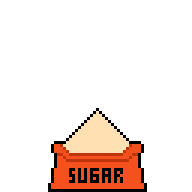

[](https://crates.io/crates/sugar-cli)
[](https://crates.io/crates/sugar-cli)
[](https://img.shields.io/github/stars/metaplex-foundation/sugar?style=social)
[](https://img.shields.io/github/forks/metaplex-foundation/sugar?style=social)
[](https://img.shields.io/github/v/release/metaplex-foundation/sugar)
[](https://github.com/metaplex-foundation/sugar/actions/workflows/build.yml)
[](https://github.com/metaplex-foundation/sugar/blob/main/LICENSE)

# Sugar: A Candy Machine CLI

<p align="center">
  
</p>

Sugar is an alternative to the current Metaplex Candy Machine CLI. It has been written from the ground up and includes several improvements:

- better performance for upload of media/metadata files and deploy of the candy machine &mdash; these operations take advantage of multithreaded systems to significantly speed up the computational time needed;
- simplified build and installation procedures taking advantage of `cargo` package management, including a binary distributable package ready to use;
- robust error handling and validation of inputs, including improvements to config and cache files, leading to more informative error messages.

See [the docs](https://docs.metaplex.com/tools/sugar/introduction) for full installation and usage instructions.

> **Note:** This is a beta release of Sugar. Use at your own risk.

## Installation

### Recommended Method

For macOS, Linux and Windows Subsystem Linux (WSL), run the following install script in your terminal:

```bash
bash <(curl -sSf https://sugar.metaplex.com/install.sh)
```


For Windows:

Download [this installer binary](https://github.com/metaplex-foundation/winstaller/releases/latest/download/winstaller.exe) and execute it. Since it is not a verified Windows binary you may have to choose "Run Anyway" from "More Info" on the pop-up Windows dialog. 

> **Dependencies:**
> When installing on Ubuntu or WSL (Windows Subsystem Linux), you may need to install some additional dependencies:
>
> ```bash
> sudo apt install libudev-dev pkg-config unzip
> ```


### Developers

Using Crates.io:

```bash
cargo install sugar-cli
```


Build From Source:

```bash
cargo install --path ./
```


## Quick Start

Set up your Solana CLI config with an RPC url and a keypair:

```bash
solana config set --url <rpc url> --keypair <path to keypair file>
```

Sugar will then use these settings by default if you don't specify them as CLI options, allowing commands to be much simpler. If you need help setting up Solana CLI and creating a `devnet` wallet, check the [Candy Machine v2 documentation](http://docs.metaplex.com/candy-machine-v2/getting-started#solana-wallet).

Create a folder named `assets` to store your json and media file pairs with the naming convention 0.json, 0.<ext>, 1.json, 1.<ext>, etc., where the extension is `.png`, `.jpg`, etc. This is the same format described in the [Candy Machine v2 documentation](http://docs.metaplex.com/candy-machine-v2/preparing-assets).

You can then use the `launch` command to start an interactive process to create your config file and deploy a Candy Machine to Solana:

```bash
sugar launch
```

At the end of the execution of the `launch` command, the Candy Machine will be deployed on-chain.
